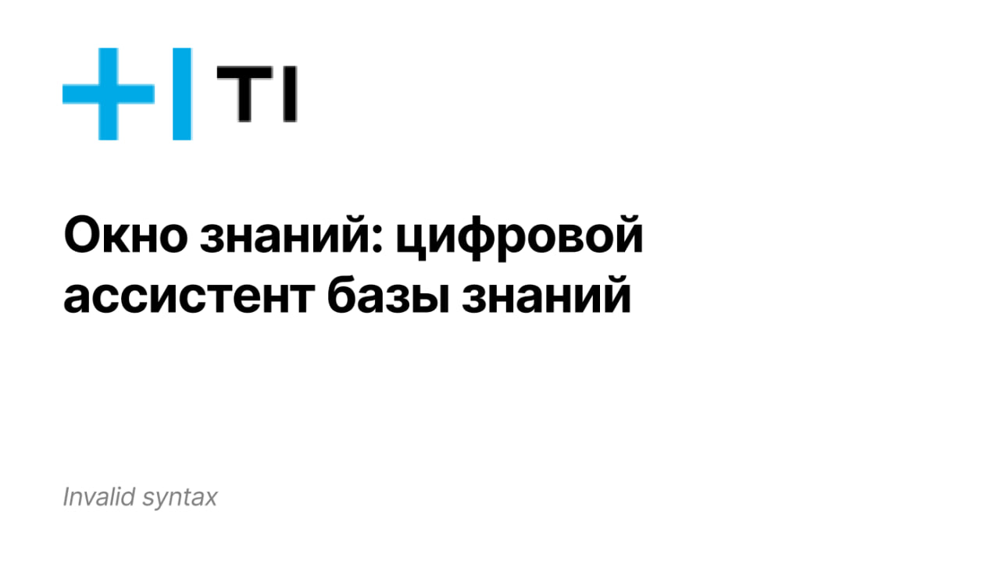

# T1-Hack



<hr>

- [T1-Hack](#t1-hack)
  - [Локальный запуск](#локальный-запуск)
  - [Как это работает?](#как-это-работает)
  - [Модели, используемые в проекте](#модели-используемые-в-проекте)
  - [Файловая структура проекта](#файловая-структура-проекта)
  - [Лицензия](#лицензия)
  - [Авторы](#авторы)

[Документация](https://t1-hack.com) Временно неактивна 😩 \
[Репозиторий с документацией](https://github.com/Trum-ok/t1-hack-documentation)

<hr>

## Локальный запуск
in dev
```bash
docker-compose -f s3/docker-compose-minio.yaml up -d
docker-compose -f db/docker-compose-postgres.yaml up -d
docker-compose -f python-app/docker-compose-py.yaml up -d
docker-compose -f docker-compose-app.yaml up -d
```
1. Запуск локального S3-хранилища
2. Запуск локальной PostgreSQL
3. Запуск python-части проекта
4. Запуск go-части проекта

> [!WARNING]  
> Локальный запуск требует серьезных вычислительных ресурсов (**GPU**)

## Как это работает?
После загрузки базы знаний на сайте, происходит ее индексация - преобразование в вектора. Благодаря этому становится возможным семантический поиск между запросом пользователя и информацией в загруженной базе знаний. Основная идея этого проекта - использование RAG (Retrieval Augmented Generation) для LLM. Добавление/обновление баз знаний не требует много ресурсов и времени, а результат остается на высоте!

> [!TIP]
> Чтобы ускорить поиск в базе знаний, **стоит использовать GPU**

## Модели, используемые в проекте
- [DeepPavlov/rubert-base-cased-sentence](https://huggingface.co/DeepPavlov/rubert-base-cased-sentence) - токенизация для семантического поиска
- [Anthropic Claude 3.5 Sonnet](https://www.anthropic.com/news/claude-3-5-sonnet) - для использование по API на сайте
- [meta-llama/Llama-3.2-3B-Instruct](https://huggingface.co/meta-llama/Llama-3.2-3B-Instruct) - для локальных запусков / запусков в контуре

> [!WARNING]  
> Локальный запуск требует указание токена доступа с hugging face, так как llama 3.2 является gated-моделью, к которой надо получать доступ.

## Файловая структура проекта
```bash
 
 ```

 ## Лицензия

This project is licensed under the MIT License.

## Авторы

Создано командой Invalid Syntax с большой любовью и огромными усилиями 💗
